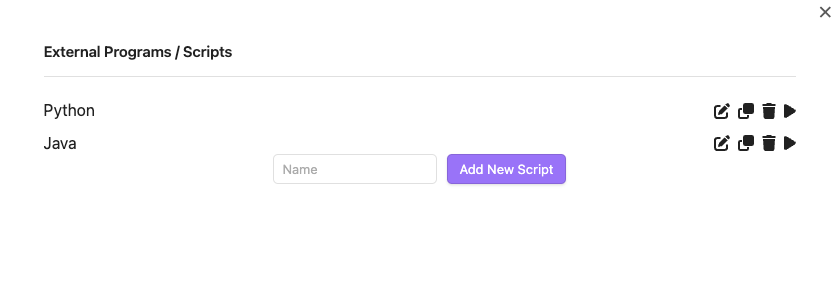
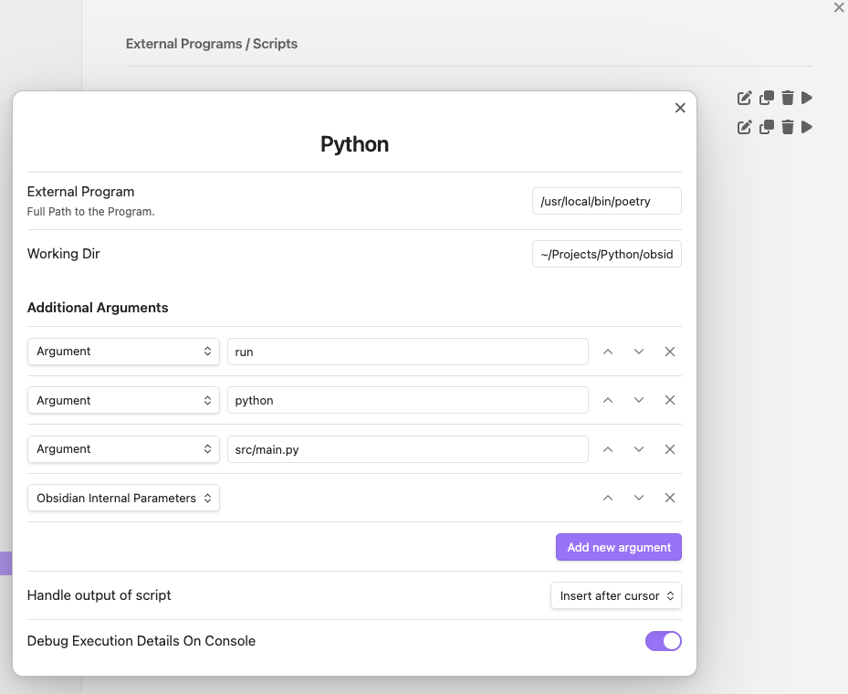

# Obsidian External Launcher

## Summary
The Obsidian External Launcher plugin allows users to launch external programs and scripts directly from within Obsidian. This plugin is particularly useful for users who need to run scripts or programs with specific arguments and capture their output back into Obsidian.  
For the sake of simplicity, I will use the term "script" to refer to both scripts and programs in this document.

## Key Features:

- **Execute External Programs**: Run any external program or script with specified arguments.
- **Dynamic Argument Handling**: Supports various argument templates such as vault path, filename, filename without extension, relative filename, full filename, and JSON structure of Obsidian data.
- **Debug Output**: Option to enable detailed debug output, including the command executed, working directory, and execution time.
- **Insert Handling**: Control where the output of the executed script is inserted in the active editor (cursor position, or not at all).
- **Execution Time Measurement**: Measures and formats the execution time of the script in a human-readable format.

## Usage:

- Go to the Options Page and add a new Script. Give it a name (this is not the name of the script file)
- It should appear in the list of scripts. Click on the icon to edit it.



- Add the path to the script file in the `External Program` field. This should be an absolute path to the script.
- Enter the working directory in the `Working Dir` field. This is the directory where the script will be executed. You may make use of the '~' tilde character to represent the home directory.
- Add any number of arguments in the `Additional Arguments` field. You can use the argument templates to insert dynamic values.
  - Templates are:
    - _Argument_: Normal manual argument to be passed to the script
    - _Vault Path_: The path to the vault (comes from Obsidian)
    - _Filename with Extension_: The name of the file with the extension
    - _Filename without Extension_: The name of the file without the extension
    - _Relative Filename_: The path to the file relative to the vault
    - _Full Filename_: The full path to the file
    - _Obsidian Data_: A JSON structure of the Obsidian data (containing everything from above and more like cursor positions)
- Determine how the plugins handles the output of the script:
  - _Insert at Cursor_: Inserts the output at the cursor position in the active editor
  - _Replace Selection_: Replaces the selected text in the active editor with the output
  - _Do Nothing_: Does not insert the output anywhere
- Debug Output: Enable this option to see detailed debug output in the console (useful for troubleshooting). Open the Obsidian devleopment console for this.
- Save the script and close the options page.



To run the script, execute it from the command pallette (see below). The output will be inserted into the active editor according to the settings you specified.
If you run the script from the table view, the insert option will be ignored. This is useful if you want to run a script quickly and work on arguments or for debugging purposes.

To delete or duplicate a script, click on the appropriate icons.

To rename a script, edit the details and click on the title to rename it.

## Commands

Every script is autmatically added to the command palette. You can run the script by typing the name of the script in the command palette and pressing enter.
The commands will be prefixed with "External Launcher: " followed by the name of the script.

You may also assign a keyboard shortcut to the command in the settings.

## Use cases

It is completely up to you how to use this plugin. Here are some examples:

- Run a script to alter the content of the current note (Obsidian will pick up the changes immediately)
- Run a script to get additional information from your system or from the internet and insert it into the current note
- Syncing your notes with an external system (tasks, events, time spent, etc.)
- Call a REST service and insert the result into the current note.


## Warning
Be careful with the scripts you run. They can do anything on your system. The plugin does not check the content of the scripts. It is up to you to make sure they are safe to run. Scripts may also destroy your vault, so beware of that.
Test your scripts in a safe environment before running them in Obsidian.
I will take no responsibility for any damage caused by running scripts with this plugin.

## Tribute	
I learned a lot from mainly three plugins I found extremely helpful:
- [Python Scripter](https://github.com/nickrallison/obsidian-python-scripter) by [Nick Allison](https://github.com/nickrallison) 
  - who inspired me to write this plugin and not stick to Python but use any kind of programs / scripts.
- [Quick Add](https://github.com/chhoumann/quickadd) by [Christian Houmann](https://bagerbach.com/)
  - where I learned how to add multiple commands and write a bunch of Svelte code to manage the UI.
- [Templater](https://github.com/SilentVoid13/Templater) by [SilentVoid13](https://github.com/SilentVoid13)
  - where I learned to manage the dynamic arguments.

So without them, this plugin would not have been possible. Thank you!

## Support
This is the first plugin I've ever written for Obsidian and there may be many features to come. I have not tested it with the Windows version, as I have no Window PC at home. Should be ok with Mac / Linux. Desktop versions only

If you like the plugin, feel free to add comments on github or in the Obsidian forum. If you find bugs, please report them on github. I will try to fix them as soon as possible.

# Examples
I will post some excerpts from the data.json file to show you how the data looks like. 
You may transfer the data to the UI for yourself. May be at a later time, I will provide an import/export function for the scripts.

### Python example
Code will be in [examples/Python/obsidian_test](./examples/Python/obsidian_test)

>This examples shows how to start a rather complex Python project with some managed dependencies (Poetry) and a main.py file.
```json
{
	"name": "Python",
	"id": "0a1dbb99-ba0d-46f6-8ab5-394db0323523",
	"additional_args": [
		{
			"argument": "run",
			"template": "argument"
		},
		{
			"argument": "python",
			"template": "argument"
		},
		{
			"argument": "src/main.py",
			"template": "argument"
		},
		{
			"argument": "",
			"template": "json_struct"
		}
	],
	"externalProgram": "/usr/local/bin/poetry",
	"insert_handling": "end",
	"currentWorkingDirectory": "~/Projects/Python/obsidian_test",
	"debug_output": true
}
```

### Java example
Code will be in [examples/Java/ObsidianTest](./examples/Java/ObsidianTest)

>Please update all paths according to your environment. I use the openjdk-23 in the example and compile it with IntelliJ IDEA.

```json
    {
      "name": "Java",
      "id": "8a1c19ae-5532-4ada-9f09-76712e6503a9",
      "additional_args": [
        {
          "argument": "-classpath",
          "template": "argument"
        },
        {
          "argument": "~/Projects/Java/ObsidianTest/out/production/ObsidianTest",
          "template": "argument"
        },
        {
          "argument": "Main",
          "template": "argument"
        },
        {
          "argument": "",
          "template": "filename"
        },
        {
          "argument": "",
          "template": "filename_no_ext"
        }
      ],
      "externalProgram": "~/Library/Java/JavaVirtualMachines/openjdk-23/Contents/Home/bin/java",
      "insert_handling": "none",
      "currentWorkingDirectory": "~/Projects/Java/ObsidianTest/out/production/ObsidianTest",
      "debug_output": true
    }
```
